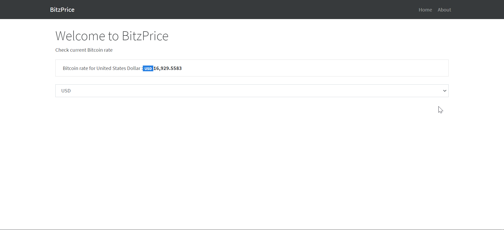

# BitzPrice

The Application is used to check on the current price of BitCoin.
Using the API from <b>Coindesk.com</b>.

You can select upto three currencies in the dropdown.
Its a minimal implementation of next js.

# Install and Run

Clone the repository and then type these commands in order.

```
cd Bitzprice
npm install
npm run dev
```

This will install and start the package.
Next js is a package that enables running react on server side and providing pre-rendered pages thus giving a performance boost to your applications.

# Screenshot



# Author

Karan Mittal
